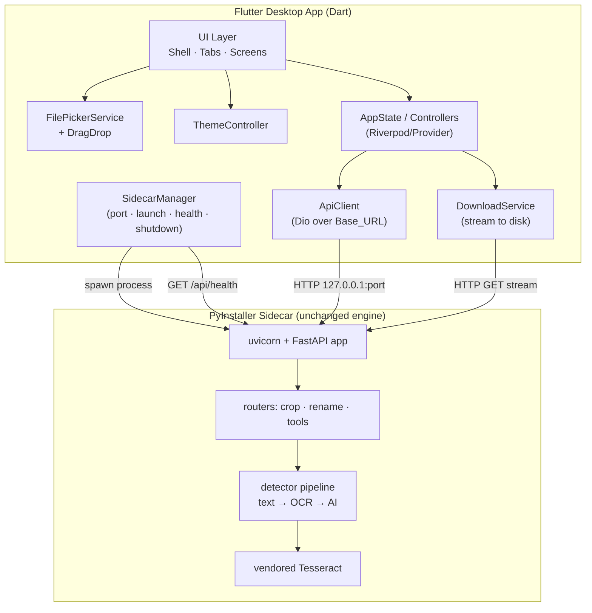
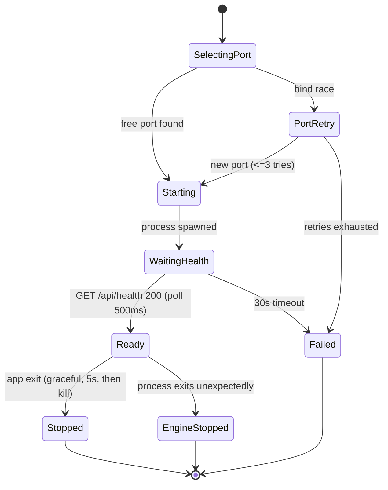

# Design Document

## Overview

This design replaces Qpic's two desktop window shells (`desktop.py`/pywebview and `desktop_qt.py`/PySide6) with a native **Flutter desktop application** for macOS and Windows. The Flutter app is purely a new HTTP client of the existing FastAPI engine. The engine is packaged unchanged as a **PyInstaller sidecar** that the Flutter app launches, health-checks, and drives over a private localhost port.

The design's central commitment: the Python engine under `app/`, the detection pipeline, crop/stitch logic, the Tools backend, the vendored-Tesseract approach, and every API contract stay byte-for-byte identical. Nothing about *what the app does* changes. Only the window/UI technology changes from an embedded web view to native Flutter widgets that call the same endpoints.

The work is staged to allow parity verification at each step:

1. **Sidecar bootstrap** — package the engine, launch/health/shutdown lifecycle.
2. **Core screens** — app shell, tabs, themes, Auto/Manual Crop forms, Rename Batch.
3. **Review canvas** — the high-risk interactive page-preview surface (must reach full parity before "done").
4. **Tools** — Compress / Preflight / Edit + OCR.
5. **Packaging + CI** — installers, signing hooks, GitHub Actions on macOS + Windows.

### Goals

- Faithfully recreate every behavior of the web UI (`static/index.html`, `static/edit.html`, `static/edit.js`) as native Flutter, with no loss of features.
- Reuse the proven server-bootstrap behavior already present in `desktop.py` (free-port pick, `/api/health` wait, per-user writable temp dir, native Save-As bridge, in-app Help, edit/zoom shortcuts).
- Keep OCR fully offline with the same `TESSERACT_CMD` → bundled → system → PATH lookup order.

### Non-Goals

- No change to the FastAPI engine, schemas, routers, services, or detector pipeline.
- No PDF rasterization in Dart — all page previews are server-rendered PNGs fetched from the engine.
- No new network calls beyond the AI tier the engine already makes when Online mode is enabled.
- No re-implementation of detection, OCR, crop/stitch, answer-key, or PDF-tool logic in Dart.

### Requirements Traceability

| Requirement | Design Section |
|---|---|
| 1 Engine/API preservation | API Contract Layer; Non-Goals |
| 2 Sidecar packaging | Sidecar Packaging |
| 3 Sidecar lifecycle | Sidecar Manager |
| 4 Shell/tabs/themes | Application Shell; Theme Controller |
| 5 Auto Crop | Crop Feature; API Client |
| 6 Smart analyze/review | Crop Feature; Review Canvas |
| 7 Manual Crop | Manual Crop Feature; Review Canvas |
| 8 Review canvas parity | Review Canvas (detailed) |
| 9 Snap to content | Review Canvas — Snap |
| 10 Review notes/Fix | Review Notes Panel |
| 11 Output downloads | Download Service |
| 12 Rename Batch | Rename Feature |
| 13 Compress | Tools — Compress |
| 14 Preflight | Tools — Preflight |
| 15 Edit + OCR | Tools — Edit |
| 16 Native Save-As | Download Service |
| 17 Native file open | File Picker Service |
| 18 Drag-and-drop | Drag-and-Drop |
| 19 Menus/Help/shortcuts | Menus, Help, Shortcuts |
| 20 Offline Tesseract | Sidecar Packaging — Tesseract |
| 21 Packaging/installers | Packaging & Installers |
| 22 Build/run-from-source | Build Scripts & Dev Workflow |
| 23 CI workflow | CI Workflow |
| 24 Cross-platform | All sections; Cross-Platform Notes |

## Architecture

### High-level component view



The Flutter process owns the window and all interaction. The sidecar is a headless child process running the same uvicorn+FastAPI stack `desktop.py` runs today via `_run_server` (loop=asyncio, http=h11, ws=none). The two communicate only over `http://127.0.0.1:{port}`.

### Why a sidecar instead of an embedded interpreter

The engine depends on PyMuPDF, Pillow, OpenCV, pytesseract, anthropic/httpx, and uvicorn — a heavy native-Python stack. Embedding CPython in the Flutter process would be fragile across macOS/Windows and would risk drift from the source-of-truth engine. Running the *exact* PyInstaller bundle the project already produces keeps the engine identical to the current desktop build and isolates crashes. This mirrors the established Tauri/Electron "sidecar" pattern.

### Project layout (added files)

```
qpic/                              # repo root (existing)
├── app/                           # UNCHANGED engine
├── static/                        # UNCHANGED web UI (kept; engine still serves it)
├── desktop/                       # NEW — Flutter desktop project
│   ├── pubspec.yaml
│   ├── lib/
│   │   ├── main.dart
│   │   ├── app.dart               # MaterialApp, theme, top-level shell
│   │   ├── core/
│   │   │   ├── sidecar_manager.dart
│   │   │   ├── api_client.dart
│   │   │   ├── download_service.dart
│   │   │   ├── file_picker_service.dart
│   │   │   ├── paths.dart         # per-OS writable dir, sidecar path resolution
│   │   │   └── theme_controller.dart
│   │   ├── models/                # Dart mirrors of schemas.py (DTOs only)
│   │   │   ├── crop.dart
│   │   │   ├── analyze.dart
│   │   │   ├── rename.dart
│   │   │   └── tools.dart
│   │   ├── features/
│   │   │   ├── shell/              # app bar, tab bar, help, theme switcher
│   │   │   ├── auto_crop/
│   │   │   ├── manual_crop/
│   │   │   ├── review/            # the canvas + notes + item list
│   │   │   │   ├── review_controller.dart
│   │   │   │   ├── review_canvas.dart
│   │   │   │   ├── review_painter.dart
│   │   │   │   ├── canvas_geometry.dart
│   │   │   │   └── review_notes_panel.dart
│   │   │   ├── rename/
│   │   │   └── tools/
│   │   │       ├── compress/
│   │   │       ├── preflight/
│   │   │       └── edit/
│   │   └── widgets/               # shared widgets (drop target, etc.)
│   ├── macos/                     # Flutter macOS runner (+ entitlements)
│   └── windows/                   # Flutter windows runner
├── packaging/                     # NEW — sidecar spec + installer config
│   ├── sidecar.py                 # sidecar entry point (thin: bootstrap engine)
│   ├── sidecar.spec               # PyInstaller spec for the headless sidecar
│   ├── macos/                     # dmg config, entitlements, notarize hook
│   └── windows/                   # msi/NSIS config, Authenticode hook
├── build_desktop_flutter.sh       # NEW — macOS/Linux build driver
├── build_desktop_flutter.ps1      # NEW — Windows build driver
└── .github/workflows/build-desktop.yml   # UPDATED
```

`desktop.py`, `desktop_qt.py`, and their `.spec`/build scripts are retained until the Flutter build is validated, then retired (see Retirement Recommendation).

## Components and Interfaces

### Sidecar entry point (`packaging/sidecar.py`)

A thin, headless launcher that reuses the bootstrap logic proven in `desktop.py` — minus the window. It does **not** import the engine differently or change it; it just runs uvicorn.

Responsibilities (lifted from `desktop.py`):
- Insert the resource dir (`sys._MEIPASS` when frozen) onto `sys.path` so `app` and `static` resolve.
- Read a port and temp dir from argv/env (passed by the Flutter SidecarManager) instead of choosing them itself, so the Flutter side owns port selection and the writable data dir.
- Configure Tesseract via the existing `tesseract_locator.configure_tesseract()` path (no change — the locator already checks `TESSERACT_CMD` → bundled → system → PATH).
- Run `uvicorn.Server` with `loop="asyncio", http="h11", ws="none"` (identical to `_run_server`).

```python
# packaging/sidecar.py  (pseudocode — engine import is unchanged)
def main() -> int:
    res = _resource_dir()                  # sys._MEIPASS or file dir
    sys.path.insert(0, str(res))
    port = int(os.environ["QPIC_PORT"])    # provided by Flutter
    os.environ.setdefault("TEMP_DIR", os.environ["QPIC_TEMP_DIR"])
    host = "127.0.0.1"
    import uvicorn
    from app.main import app               # the unchanged FastAPI app
    uvicorn.Server(uvicorn.Config(
        app, host=host, port=port,
        log_level="warning", loop="asyncio", http="h11", ws="none",
    )).run()
```

**Design choice — who picks the port.** Today `desktop.py` picks the free port itself. We move port selection into the Flutter SidecarManager (Dart) so the Flutter side can bind-test, pass it via `QPIC_PORT`, and retry cleanly on conflict (Req 3.8). The sidecar simply honors the given port. This keeps a single owner for the localhost contract.

### SidecarManager (`lib/core/sidecar_manager.dart`)

Owns the sidecar process lifecycle (Req 3).

State machine:



Interface:

```dart
class SidecarManager {
  Future<Uri> start();          // returns Base_URL on Ready; throws SidecarStartException
  Future<void> stop();          // graceful term, force-kill after 5s
  Stream<SidecarStatus> status; // Starting/Ready/Failed/EngineStopped for UI
  Uri get baseUrl;
}
```

Key behaviors mapped to requirements:
- **Port selection (3.1, 3.8):** bind a `ServerSocket` to `127.0.0.1:0`, read the assigned port, close it, then pass to the sidecar. On a bind race (process can't bind), pick another and retry up to 3 times. The chosen port is in the ephemeral range, satisfying 1024–65535.
- **Spawn (3.2):** `Process.start(sidecarPath, [], environment: {QPIC_PORT, QPIC_TEMP_DIR, TESSERACT_CMD?})`. Capture stdout/stderr for diagnostics in the failure message.
- **Health wait (3.3, 3.4):** poll `GET /api/health` every 500 ms until HTTP 200 with `{"status":"ok"}` or 30 s elapses. On success, publish `Base_URL = http://127.0.0.1:{port}`.
- **Startup failure (3.5, 3.9):** on timeout or retry exhaustion, surface a human-readable message that includes captured stderr; UI stays disabled.
- **Clean shutdown (3.6, 3.7):** on app exit, send graceful termination (`SIGTERM`/`process.kill`), wait 5 s, then force-kill (`SIGKILL`/`taskkill /F`). Register the shutdown on Flutter's `AppLifecycleState.detached` and on window-close intercept (`window_manager`) so no orphan remains.
- **Unexpected exit (3.10):** listen to `process.exitCode`; if it completes while status is Ready, transition to `EngineStopped`, disable the UI, and show "the engine stopped".
- **Writable temp dir (3.11, 24.4):** compute the per-OS dir (`paths.dart`) and pass as `QPIC_TEMP_DIR`. macOS `~/Library/Application Support/Qpic/temp`, Windows `%LOCALAPPDATA%\Qpic\temp` — identical to `desktop._writable_data_dir()`.

Orphan-prevention detail: on Windows, spawn the sidecar in a Job Object (via a small launcher or `Process` kill-tree) so a hard Flutter crash also tears down the child; on macOS the force-kill on `detached` plus exit-code watch covers it. As a backstop, the sidecar writes its PID to `QPIC_TEMP_DIR/sidecar.pid` and the manager reaps a stale PID on next launch.

### ApiClient (`lib/core/api_client.dart`)

A thin Dio wrapper bound to `Base_URL`. It mirrors the engine's endpoints exactly — no path, parameter, or body reshaping (Req 1.1, 1.3). All endpoints below are taken verbatim from the routers.

| Method | Endpoint | Params (as engine defines) |
|---|---|---|
| GET | `/api/health` | — |
| POST | `/api/crop` | query: `dpi,padding,marker_style,has_questions,question_pages,has_answers,answer_pages,question_prefix,solution_prefix,start_number,image_format,jpg_quality,use_ai,answer_sheet`; multipart `file` |
| POST | `/api/analyze` | query: `dpi,marker_style,has_questions,question_pages,has_answers,answer_pages,use_ai,answer_sheet`; multipart `file` |
| POST | `/api/prepare-manual` | query: `dpi`; multipart `file` |
| GET | `/api/analyze/{job_id}/page/{page_no}` | preview PNG |
| POST | `/api/snap` | JSON `SnapRequest` |
| POST | `/api/finalize` | JSON `FinalizeRequest` |
| GET | `/api/crop/download/{job_id}` | query: `kind,question_prefix,solution_prefix` |
| POST | `/api/rename/preview` | form: `names[],pattern,start,padding` |
| POST | `/api/rename/pdf-to-images` | multipart `file` |
| POST | `/api/rename/session` | — |
| POST | `/api/rename/session/{id}/files` | multipart `files[]` |
| POST | `/api/rename/session/{id}/finalize` | form: `pattern,start,padding,names,output_format,jpg_quality` |
| GET | `/api/rename/session/{id}/download` | zip |
| DELETE | `/api/rename/session/{id}` | — |
| POST | `/api/tools/compress` | form: `level` or `target_mb`; multipart `file` |
| GET | `/api/tools/compress/download/{job_id}` | pdf |
| POST | `/api/tools/preflight` | multipart `file` |
| POST | `/api/tools/preflight/fix-page-sizes` | form: `target,fill_mode,skip_pages`; multipart `file` |
| GET | `/api/tools/preflight/download/{job_id}` | pdf |
| POST | `/api/tools/edit/open` | multipart `file` |
| GET | `/api/tools/edit/{job_id}/state` | spans+geometry |
| GET | `/api/tools/edit/{job_id}/page/{page_no}` | preview PNG |
| POST | `/api/tools/edit/apply` | JSON `EditApplyRequest` |
| POST | `/api/tools/edit/ocr` | form: `languages,dpi`; multipart `file` |
| GET | `/api/tools/edit/download/{job_id}` | pdf |

Error handling: the engine returns errors as `{"detail": "..."}` with a 4xx/5xx code (see `HTTPException` usage). The ApiClient surfaces `detail` verbatim to the UI (Req 5.8, 6.7, 7.6, 12.6, 13.5, 14.6). A typed `ApiException(statusCode, detail)` carries it.

### DTOs (`lib/models/`)

Plain Dart data classes mirroring `schemas.py` field-for-field (names and nullability preserved). These are transport DTOs only — no engine logic. Examples: `CropResponse`, `AnalyzeResponse`, `PageInfo`, `AnalyzedItem`, `ReviewNote`, `QuestionSegment`, `SnapRequest/Response`, `FinalizeItem/Request`, `CompressResponse`, `PreflightResponse`, `EditExtractResponse`, `EditableSpanModel`, `EditPageModel`. JSON keys match exactly (e.g. `x_start_pct`, `questions_download_url`, `answer_key_count`).

### Application Shell (`lib/features/shell/`)

Recreates the Acrobat-style top app bar and tool tabs (Req 4).

- Top app bar: Qpic brand, four `TabBar`-style tabs (Auto Crop, Manual Crop, Rename Batch, Tools), Help control, theme switcher (segmented Light/Dark/System).
- An `IndexedStack` holds the four tool views so only the selected one is visible while the others retain state (4.3). Default index 0 = Auto Crop (4.4).
- Each tool view is a feature widget with its own controller; switching tabs does not tear down state.

### Theme Controller (`lib/core/theme_controller.dart`)

- `ThemeMode` (light/dark/system) persisted via `shared_preferences` (4.7, 4.8).
- First launch with no stored value defaults to `system` (4.9); a stored value is re-applied on launch before first paint.
- `system` follows `MediaQuery.platformBrightness`, which updates live when the OS preference changes (4.6, 4.7).
- Light/dark palettes reproduce the web UI's CSS variables (brand color, success/warn/danger accents used by box outlines and note chips) so the canvas and notes look consistent.

## Review Canvas (high-risk) — `lib/features/review/`

This is the single highest-risk component. It must reach behavioral parity with the web canvas (`static/index.html`) before the feature is "done" (Req 8, 24.2). The web implementation uses absolute-positioned `%`-based DOM elements over an ``; we reproduce the identical math with a `CustomPainter` + `GestureDetector` and explicit hit-testing.

### Coordinate model

The engine's contract is **page-percentage coordinates**: every `QuestionSegment` carries `x_start_pct, x_end_pct, y_start_pct, y_end_pct` in 0–100 of page width/height, with end ≥ start (Req 8.1). The canvas keeps boxes in this space and converts to/from screen pixels for rendering and input. This matches the web UI's `pointPct()` (pixel → percent on pointer) and `placeSel()` (percent → CSS `%`).

Three coordinate spaces and their transforms:

```
page-percent (0..100)  ⇄  image-content px (preview natural size × zoom)  ⇄  widget/screen px (+ pan offset)
```

`canvas_geometry.dart` centralizes the transforms so painter and gesture code share one source of truth:

```dart
class CanvasGeometry {
  final Size pageDisplaySize;   // preview size after zoom (fit-width baseline)
  final Offset panOffset;       // scroll translation
  final double zoom;            // clamped 0.25..6.0

  Offset pctToScreen(double xPct, double yPct);
  Offset screenToPct(Offset local);   // clamps to 0..100 (== clamp01)
  Rect   segToScreenRect(QuestionSegment s);
}
```

`screenToPct` clamps to 0–100 exactly like the web `clamp01` and `pointPct` clamp, so drawn/edited boxes never escape the page (Req 8.4, 8.6).

### Rendering: `ReviewPainter` (`CustomPainter`)

- Paints the page preview (`ui.Image` decoded from `Image.network(preview_url)` against `Base_URL`; the bytes are server-rendered PNGs — no Dart PDF rasterization, Req 1.5, 6.3).
- For each `AnalyzedItem` whose segment is on the current page, draws a **dashed outline only** (no fill) — matching the web `.existing-box` rule whose comment explains fills stack into an opaque mass where boxes overlap. Color encodes type/flag/editing state (question vs solution vs flagged vs being-edited), reproducing the web classes.
- Draws the question number label per box.
- During a drag, draws the in-progress selection rectangle (the web `.sel-box`).
- During re-select, draws resize handles and a per-box delete affordance on the active item (web `.box-del` and handle behavior).

`shouldRepaint` is driven by the `ReviewController` state revision so panning, zooming, hover, and edits repaint efficiently.

### Input: `GestureDetector` + `MouseRegion`

| Web behavior | Flutter implementation | Req |
|---|---|---|
| Hover shows q-number | `MouseRegion.onHover` → hit-test → set hovered index → repaint tooltip/label | 8.3 |
| Drag on empty area draws a box | `onPanStart/Update/End` when not over a box and not editing → build segment | 8.4 |
| Tiny drag ignored (<1.5%) | on pan end, discard if `(x1-x0) < 1.5 || (y1-y0) < 1.5` (verbatim from `endDraw`) | 8.5 |
| Re-select an item (additive) | enter edit mode; new boxes append to the item's `segments`; handles move/resize | 8.6 |
| Delete a box | per-box ✕ in edit mode removes a segment; empty item is dropped on Done | 8.7 |
| Pan | drag with space/middle or scroll; translate `panOffset` only — never mutate pct | 8.8 |
| Zoom | Ctrl/Cmd +/-/0 and trackpad pinch; `clampZoom` to 0.25..6.0, fit-width = 100% | 8.9 |
| Hit-test precedence | iterate items top-most first; return first whose `segToScreenRect` contains the point | 8.10 |
| Overlap → replace not duplicate | on new box, `findOverlappingItem` via IoU ≥ 0.6 among same-type items → replace, keep number | 8.11 |
| Page navigation | clamp target to first..last; show only that page's preview + its boxes | 8.12 |
| Per-type auto numbering | `nextAutoNumber(isSolution)` = max same-type number + 1 | 8.13 |

The IoU helper is ported exactly from the web `segIoU`:

```dart
double segIoU(QuestionSegment a, QuestionSegment b) {
  if (a.page != b.page) return 0;
  final ix0 = max(a.xStart, b.xStart), iy0 = max(a.yStart, b.yStart);
  final ix1 = min(a.xEnd, b.xEnd),     iy1 = min(a.yEnd, b.yEnd);
  final inter = max(0, ix1 - ix0) * max(0, iy1 - iy0);
  if (inter <= 0) return 0;
  final areaA = (a.xEnd-a.xStart)*(a.yEnd-a.yStart);
  final areaB = (b.xEnd-b.xStart)*(b.yEnd-b.yStart);
  final union = areaA + areaB - inter;
  return union > 0 ? inter / union : 0;
}
```

`OVERLAP = 0.6` and `nextAutoNumber` are reproduced identically, so the "redrew Q3 → still one Q3, not two" behavior holds (the exact bug the web code documents).

### Re-select semantics (additive)

Matching `applyReselect`/`startEditing`:
- Entering re-select on item *i* sets `editingIndex = i`, locks `manualOrder = true`, and jumps to the item's first page.
- Each subsequent drawn box is **appended** to that item's `segments` (cross-page parts a, b, c… in draw order), never sorted once `manualOrder` is set.
- The item's `source` becomes `manual`, `flagged` clears, and any matching `ReviewNote` is removed (the note is "fixed").
- "Done" exits edit mode; an item left with zero segments is removed.

### Snap to content (Req 9)

When the Snap toggle is on, on box-end the controller calls `POST /api/snap` with `{job_id, page, x_start_pct, x_end_pct, y_start_pct, y_end_pct}` and replaces the box with the returned tightened rect. On any error or unchanged response, the drawn box is kept as-is (the engine itself echoes the box back when it can't snap) — never degraded. This mirrors `snapSegment`'s try/fallback.

### ReviewController

Holds review state and is reused by Smart Auto Crop (from `/analyze`) and Manual Crop (from `/prepare-manual`):

```dart
class ReviewState {
  String jobId;
  List<PageInfo> pages;        // absolute page numbers + preview_url
  List<ReviewItem> items;      // q_num,is_solution,segments,source,flagged,flag_reason
  List<ReviewNote> notes;
  int currentPageIndex;
  int editingIndex;            // -1 when not re-selecting
  double zoom; Offset pan;
  int? answerKeyCount;
}
```

Finalize builds a `FinalizeRequest` from `items` plus the active tool's output config and calls `POST /api/finalize` (Req 6.6, 7.4). Manual mode blocks finalize when `items` is empty (7.5) and retains items on error (7.7).

### Review Notes Panel (`review_notes_panel.dart`) — Req 10

- Renders each `ReviewNote` with `kind` + `message`; empty list shows the "detection looks complete" advisory (10.1, 10.2).
- Note kinds (`duplicate`, `gap`, `tiny`, `incomplete`, `low_confidence`) are visually distinguished by color/icon chips reproducing the web styling (10.5).
- A note with `kind == "incomplete"` and non-null `q_num` shows a **Fix** action that navigates to the item's page and enters re-select on it (10.3, 10.4) — exactly what the web "Fix" button does via `startEditing`.

## Feature Screens

### Auto Crop (`lib/features/auto_crop/`) — Req 5, 6

Form controls: Questions toggle + page-range field, Solutions toggle + page-range field, Smart-mode toggle, Online-mode toggle, Answer-sheet toggle, question-numbering selector (Auto-detect/Q-only/numbered → `marker_style` auto/q/numbered), and output config (question prefix, solution prefix, start number, image format PNG/JPG, JPG quality). Each control is constrained to the engine's accepted bounds (5.3): `dpi` 72–600, `padding` 0–200, `start_number` 1–100000, `jpg_quality` 1–100, prefixes ≤ 10 chars.

Submit logic:
- Guards before any request (5.5–5.7): if Questions on with empty range, or Solutions on with empty range, or both toggles off → block, keep values, show the matching prompt (`ERR_QUESTION_PAGES_REQUIRED` / `ERR_ANSWER_PAGES_REQUIRED` / `ERR_NOTHING_SELECTED` semantics).
- **Smart off:** `POST /api/crop` → on success show download actions for whichever archives `CropResponse` reports (`download_url` always; `questions_download_url`/`solutions_download_url` when present) (5.9, 11).
- **Smart on:** `POST /api/analyze` → open Review Canvas with `pages`, `items`, `notes`; inform whether finalized output includes an answer sheet from `answer_key_count` (6.2, 6.4, 6.5). Finalize via `/api/finalize` then download.
- On engine error, show `detail` and do not open the canvas (5.8, 6.7).

### Manual Crop (`lib/features/manual_crop/`) — Req 7

- Open PDF → `POST /api/prepare-manual` (query `dpi`) → open Review Canvas with empty item list and all page previews (7.1, 7.2).
- Independent output fields (prefix/start/format/quality) held in the Manual Crop controller, separate from Auto Crop's (7.3).
- Finalize → `POST /api/finalize` with hand-drawn items + Manual Crop's output config (7.4). Blocks on empty list (7.5); error path keeps items (7.6, 7.7).

### Rename Batch (`lib/features/rename/`) — Req 12

Controls: naming pattern, start (0–1,000,000), zero-padding (0–12), output format (original/png/jpg/jpeg/webp), JPG quality (1–100).

- Live preview as controls change → `POST /api/rename/preview` with `names[],pattern,start,padding` (no image bytes uploaded) (12.2).
- Add a PDF → `POST /api/rename/pdf-to-images`; each page returns as a `data:` URL item that becomes a renamable entry (12.3).
- Rename → streamed **session flow** (matches the web client for large batches, 12.4):
  1. `POST /api/rename/session` → `session_id`
  2. chunked `POST /api/rename/session/{id}/files` (multipart `files[]`, ~200/req)
  3. `POST /api/rename/session/{id}/finalize` (form `pattern,start,padding,names,output_format,jpg_quality`)
  4. `GET /api/rename/session/{id}/download` (saved via DownloadService)
  5. `DELETE /api/rename/session/{id}` after download (12.5)
- Errors surface `detail` (12.6).

Note: the `names` field carries the UI's expanded variable tokens as a JSON array (the engine treats explicit stems as authoritative). The Flutter side computes the same token expansion the web UI does client-side, then sends stems — no engine change.

### Tools — Compress (`lib/features/tools/compress/`) — Req 13

Level selector (light/balanced/strong/extreme) + optional target-MB (>0). `POST /api/tools/compress` (form `level` or `target_mb`, multipart `file`). Show `original_size`, `compressed_size`, `ratio`; download via the response `download_url`. Errors show `detail`.

### Tools — Preflight (`lib/features/tools/preflight/`) — Req 14

`POST /api/tools/preflight` → render `verdict`, `page_count`, `page_sizes`, `checks`, `fonts`, `images`, `page_details`. When `mixed_page_sizes` is true, show a "Fix page sizes" action → `POST /api/tools/preflight/fix-page-sizes` (form `target`, `fill_mode` fit/stretch, `skip_pages`) → download normalized PDF via response `download_url`. Errors show `detail`.

### Tools — Edit + OCR (`lib/features/tools/edit/`) — Req 15

The most involved Tools screen; reproduces `static/edit.js` behavior.

- Open → `POST /api/tools/edit/open` → `EditExtractResponse` with `pages` (geometry + `preview_url`) and `spans` (`EditableSpanModel` with `bbox` in PDF points).
- Render each page via `Image.network(preview_url)`; overlay each span as a clickable box positioned by converting its `bbox` (points) to screen px using the page's `width`/`height` and the displayed image size (15.2, 15.3). This is the same point→pixel mapping the canvas uses, just sourced from PDF-point bbox instead of percent.
- Click a span → in-place editable text field; collect edits.
- Apply → `POST /api/tools/edit/apply` with `EditApplyRequest` (`operations` preferred, `edits` legacy) (15.5).
- Run OCR → `POST /api/tools/edit/ocr` (form `languages`, `dpi`) (15.6).
- Download → `GET /api/tools/edit/download/{job_id}` (15.7).
- When `has_text` is false, show the "add objects or run OCR to edit existing text" guidance (15.8).

## Native Desktop Integration

### DownloadService (`lib/core/download_service.dart`) — Req 11, 16

Replaces the web download flow (browser `<a download>`/blob) that a localhost sidecar can't trigger, mirroring the `SaveBridge.save_url` logic in `desktop.py`.

- On download, show a native Save-As dialog (`file_selector.getSaveLocation`) with a suggested filename (16.1).
- On confirm, stream the engine URL to the chosen path: `Dio.download` or a `ResponseType.stream` write so multi-GB archives never fully buffer in memory (16.3) — equivalent to `shutil.copyfileobj(..., 1MB)`.
- Cancel aborts with no file written (16.4); failures show a readable error (16.5).
- Download targets are always engine URLs joined onto `Base_URL` (combined/questions/solutions zips, compressed/normalized/edited PDFs, rename zip).

### FilePickerService (`lib/core/file_picker_service.dart`) — Req 17

- Crop/Tools flows: native open dialog filtered to `.pdf` (17.1).
- Rename Batch: native open dialog allowing images + PDF (17.2).
- Selected files are loaded into the active tool (17.3). Uses `file_selector`.

### Drag-and-Drop (`lib/widgets/drop_target.dart`) — Req 18

- `desktop_drop` (`DropTarget`) wraps each tool's drop zone.
- Dropping a PDF loads it into the active tool (18.1); a hover state indicates acceptance (18.2); a non-PDF on a PDF-only target is rejected with a "PDF required" message (18.3). Rename's target also accepts images.

### Menus, Help, Shortcuts (`lib/features/shell/`) — Req 19

- A native `PlatformMenuBar` (macOS app menu + Edit + Help) and equivalent on Windows.
- Edit menu provides cut/copy/paste/select-all (19.3) — these reach focused text fields, just as `desktop.py`'s `_install_macos_edit_menu` fixes Cmd+A/C/V/X/Z.
- Zoom shortcuts (Ctrl/Cmd +, -, 0) drive the active document view's zoom (19.4), mirroring `desktop_qt.py`'s zoom shortcuts.
- **Help is fully in-app** (19.1, 19.2): a `HelpScreen` reproduces the "How to Use" walkthrough content (overall guide, How to Crop, How to Rename Batch tabs) as native Flutter — no external links. This replaces the web modal that `desktop.py`/`desktop_qt.py` drove via JS; the content is reproduced from the walkthrough text in `static/index.html` (19.5).

The walkthrough copy will be extracted from the existing `#howToBtn` modal markup and reproduced as Dart string content/widgets, so wording matches the web UI.

## Sidecar Packaging

### PyInstaller spec (`packaging/sidecar.spec`) — Req 2, 20

Adapted from `desktop.spec`, with two changes: entry point is `packaging/sidecar.py` (headless, no pywebview) and the build is **onedir** so the Flutter installer can embed the sidecar folder.

- `datas`: `("static","static")`, `("app","app")`, `collect_data_files("fitz")`, and `("vendor/tesseract","tesseract")` when present (identical Tesseract bundling rule — 2.3, 20.1).
- `hiddenimports`: `collect_submodules("uvicorn"/"fastapi"/"anthropic")` + `h11, anyio, click, pydantic_settings` (same as today, so no missing-module errors — 2.2, 2.6).
- `console=False`, `excludes=[tkinter,pytest,matplotlib]`. No pywebview/PySide6 imports → smaller bundle.
- Resource resolution stays via `sys._MEIPASS`/`sys.executable` parent (2.5) — `tesseract_locator._bundle_dirs()` already handles both onedir and onefile.
- Missing-resource failure (2.7): the engine logs and the sidecar exits non-zero; SidecarManager reports startup failure with captured stderr.

### Tesseract bundling & lookup (Req 20)

Unchanged approach. `scripts/vendor_tesseract.py` populates `vendor/tesseract/` (binary + libs + `eng/hin/osd` tessdata) before PyInstaller; the spec ships it to `<bundle>/tesseract/`. At runtime `tesseract_locator.configure_tesseract()` resolves `TESSERACT_CMD` env → bundled `<bundle>/tesseract/tesseract[.exe]` → system install → PATH, and points `TESSDATA_PREFIX` at the bundled `tessdata` (20.2, 20.3). With no AI key and Online off, OCR runs entirely on the bundled Tesseract with no network (20.4). The SidecarManager does not set `TESSERACT_CMD` unless a dev override is provided, so the bundled copy wins in the packaged app.

## Packaging & Installers — Req 21

### macOS

- `flutter build macos` produces `Qpic.app`.
- A post-build step copies the PyInstaller sidecar onedir into `Qpic.app/Contents/Resources/sidecar/` so `paths.dart` can resolve it relative to the bundle (`Contents/Resources/sidecar/qpic-sidecar`).
- `Qpic.app` is packaged into a `.dmg` (`create-dmg` or `hdiutil`).
- Entitlements (`packaging/macos/entitlements.plist`) allow the app to spawn the sidecar child process; network entitlement is loopback only.
- **Signing/notarization hooks** (21.4): build script reads `MAC_CERT_IDENTITY`, `AC_NOTARY_PROFILE` env vars; when present it `codesign --deep`-signs the app + sidecar and `notarytool` submits the dmg. When absent it produces an unsigned build (current behavior).

### Windows

- `flutter build windows` produces the runner folder.
- Post-build copies the sidecar onedir into the runner's `sidecar/` subfolder.
- Installer via **MSIX** (`msix` pub package) or NSIS (`packaging/windows/installer.nsi`) — design supports either; default MSIX for Store-compatibility, NSIS as the `.exe` installer alternative. Both embed `sidecar/` and the bundled Tesseract.
- **Authenticode hook** (21.5): build script reads `WIN_CERT_PATH`/`WIN_CERT_PASSWORD`; when present it `signtool sign`s the app exe, sidecar exe, and installer. Absent → unsigned.

### Sidecar path resolution (`paths.dart`)

```dart
String sidecarExecutablePath() {
  if (Platform.isMacOS) {
    // .../Qpic.app/Contents/MacOS/qpic  ->  .../Contents/Resources/sidecar/qpic-sidecar
    return p.join(_resourcesDir(), 'sidecar', 'qpic-sidecar');
  }
  if (Platform.isWindows) {
    // runner dir/sidecar/qpic-sidecar.exe
    return p.join(_exeDir(), 'sidecar', 'qpic-sidecar.exe');
  }
  ...
}
```

In dev (run-from-source), `paths.dart` falls back to running the sidecar via the repo's Python (`python -m packaging.sidecar`) so developers don't need to build the PyInstaller bundle each iteration.

## Build Scripts & Dev Workflow — Req 22

New drivers replace `build_desktop.sh`, `build_desktop.bat`, and `build_desktop_qt.sh`:

- `build_desktop_flutter.sh` (macOS/Linux) and `build_desktop_flutter.ps1` (Windows):
  1. `pip install -r requirements.txt -r requirements-desktop.txt` (sidecar deps).
  2. `python scripts/vendor_tesseract.py --langs eng,hin,osd` (unchanged).
  3. `pyinstaller packaging/sidecar.spec --noconfirm` → sidecar onedir.
  4. `flutter build macos|windows`.
  5. Embed the sidecar into the Flutter bundle; package `.dmg` / MSIX|NSIS.
  6. Optional sign/notarize when cert env vars are set.

Run-from-source (dev):
1. Terminal A: `flutter run -d macos` (or `-d windows`) from `desktop/`.
2. The app auto-starts the sidecar from source via `python -m packaging.sidecar` (no PyInstaller build needed for dev) using the project's venv.
3. README "Desktop app" section updated to document this (22.2, 22.3); other README feature docs untouched (22.4).

## CI Workflow — Req 23

`.github/workflows/build-desktop.yml` updated to keep the `macos-latest` + `windows-latest` matrix and add Flutter:

```yaml
steps:
  - checkout
  - setup-python 3.12
  - install Tesseract (brew / choco)            # existing
  - pip install requirements + requirements-desktop
  - vendor_tesseract.py --langs eng,hin,osd     # existing
  - pyinstaller packaging/sidecar.spec --noconfirm
  - uses: subosito/flutter-action@v2            # NEW: install Flutter
  - flutter config --enable-(macos|windows)-desktop
  - flutter build macos|windows
  - embed sidecar + package (.dmg / MSIX|NSIS)
  - sign/notarize if secrets present            # hooks
  - upload-artifact
  - attach to Release on tag (softprops/action-gh-release)  # existing
```

This satisfies 23.1–23.6 (both OS jobs, vendor Tesseract, build sidecar, build Flutter, package installers, attach on tag).

## Data Models

The Flutter DTOs are 1:1 with `app/models/schemas.py`. No new server-side models. Representative mapping:

| schemas.py | Dart DTO | Notes |
|---|---|---|
| `QuestionSegment` | `QuestionSegment` | `xStart/xEnd/yStart/yEnd` ↔ `x_start_pct`… |
| `AnalyzeResponse` | `AnalyzeResponse` | includes `pages,items,notes,needs_review,answer_key_count` |
| `PageInfo` | `PageInfo` | `page,width_pt,height_pt,preview_url` |
| `AnalyzedItem` | `ReviewItem` | adds client-only `editing`/`manualOrder` flags (UI state, not sent) |
| `ReviewNote` | `ReviewNote` | `kind,message,q_num,page,is_solution` |
| `FinalizeRequest` | `FinalizeRequest` | built from review items + output config |
| `CropResponse` | `CropResponse` | nullable per-type download URLs |
| `CompressResponse`/`PreflightResponse`/`EditExtractResponse` | same names | tools |

Client-only UI flags (`editing`, `manualOrder`, hover state) live on the controller and are never serialized into requests, preserving the exact request shapes.

## Error Handling

- **Sidecar start failure:** blocking error screen with the captured stderr tail and a Retry action (Req 3.5, 3.9).
- **Engine stopped post-start:** non-dismissable banner disabling tool actions, with Restart (3.10).
- **API errors:** `ApiException.detail` shown inline in the relevant tool (snackbar/dialog), text taken verbatim from the engine `{"detail": ...}` (5.8, 6.7, 7.6, 12.6, 13.5, 14.6).
- **Snap failure:** silent fallback to the drawn box (9.4) — never worsen the selection.
- **Download failure:** readable error; partial files cleaned up (16.5).
- **Preview load failure:** placeholder + retry on the canvas; does not crash review.

## Correctness Properties

These invariants must hold and are the basis for the canvas/API parity tests.

### Property 1: API contract immutability

Every request the ApiClient builds matches the engine's declared path, query/form field names, and JSON body field names exactly — no field is added, dropped, or renamed.

**Validates: Requirements 1.3**

### Property 2: No Dart engine logic

The app produces no crop, detection, OCR, answer-key, or PDF-tool output computed in Dart; all such artifacts originate from engine responses.

**Validates: Requirements 1.4, 1.5**

### Property 3: Coordinate fidelity

`screenToPct(pctToScreen(p)) == p` within float tolerance for any in-range point, and all stored box coordinates remain within 0–100 with end ≥ start regardless of zoom, pan, draw, or re-select.

**Validates: Requirements 8.1, 8.4, 8.6, 8.8**

### Property 4: Zoom is bounded

The displayed zoom factor is always within [0.25, 6.0]; pan never mutates a box's page-percentage coordinates.

**Validates: Requirements 8.8, 8.9**

### Property 5: Overlap determinism

A new same-type box with IoU ≥ 0.6 against an existing box replaces it (preserving its number) rather than creating a duplicate; the count after re-drawing over an item is unchanged.

**Validates: Requirements 8.11**

### Property 6: Hit-test single-resolution

A pointer inside multiple boxes resolves to exactly one box via top-most precedence (deterministic for identical input).

**Validates: Requirements 8.10**

### Property 7: Min-box guard

A drag smaller than 1.5% of page width or height creates no box.

**Validates: Requirements 8.5**

### Property 8: Per-type numbering

An auto-numbered new box equals the max existing same-type number + 1.

**Validates: Requirements 8.13**

### Property 9: Snap never degrades

On snap error or unchanged response, the box equals the user's drawn box.

**Validates: Requirements 9.3, 9.4**

### Property 10: No orphan process

After app exit, no sidecar process from this app remains running.

**Validates: Requirements 3.7**

### Property 11: Offline OCR

With no AI key and Online off, no non-loopback network call is made during OCR.

**Validates: Requirements 1.8, 20.4**

## Testing Strategy

Unit tests (Dart, `flutter test`):
- `CanvasGeometry` transforms: pct↔screen round-trip, clamp to 0–100, zoom/pan invariance of pct coordinates.
- `segIoU` and `findOverlappingItem`: parity with web values (IoU ≥ 0.6 replace; distinct stacked boxes don't merge).
- `nextAutoNumber`: max same-type + 1 across questions/solutions.
- Min-box rejection (<1.5%) and clamp behavior.
- ApiClient request construction: exact paths/params/field names for every endpoint (guards Req 1.3).
- DTO (de)serialization against captured engine JSON fixtures.

Widget tests:
- Tab switching keeps state; default tab = Auto Crop.
- Theme persistence and system-follow.
- Crop form guards (empty ranges, nothing selected) block submission.
- Review canvas gesture flows (draw, hover label, re-select additive, delete box, page nav).
- Tools panels render response fields and wire the right endpoints.

Integration tests:
- Sidecar lifecycle against the real PyInstaller bundle (or dev sidecar): start → health → drive a crop → shutdown leaves no orphan; port-conflict retry; unexpected-exit handling.
- End-to-end crop, smart analyze→finalize→download, rename session, and each tool against a running sidecar using `sample_mcq.pdf`/`sample_searchable.pdf`.

Parity checklist (manual, both OSes — gate for "done", Req 8, 24.2): a side-by-side script comparing each web canvas behavior to the Flutter canvas (draw, snap, hover, re-select cross-page, delete, overlap-replace, zoom bounds, pan, page nav, numbering) before sign-off.

## Cross-Platform Notes — Req 24

- All four tools and the review canvas ship on macOS and Windows from one Dart codebase (24.1, 24.2).
- SidecarManager start/drive/stop works on both; Windows uses Job Object/kill-tree, macOS uses signal + force-kill (24.3).
- `paths.dart` returns the correct per-OS writable dir and sidecar path (24.4).
- Plugins chosen for full macOS+Windows desktop support: `dio`, `file_selector`, `desktop_drop`, `window_manager`, `shared_preferences`, `path`/`path_provider`.

## Retirement Recommendation: `desktop.py` / `desktop_qt.py`

**Recommendation: retire both after the Flutter build is validated on macOS and Windows, but not before.**

Reasoning:
- The Flutter app fully supersedes their role (window shell + server bootstrap + Save-As bridge + Help menus + zoom shortcuts), and all that bootstrap logic is reproduced in `SidecarManager` + `packaging/sidecar.py`.
- Keeping them during development is useful as a reference oracle for behavior parity (especially the canvas and Save-As streaming) and as a fallback if a Flutter platform issue blocks a release.
- They are **not** part of the engine, so removing them changes nothing about the API or processing. Once CI produces signed Flutter installers for both OSes and the parity checklist passes, delete `desktop.py`, `desktop_qt.py`, `desktop.spec`, `desktop_qt.spec`, `build_desktop.sh`, `build_desktop.bat`, `build_desktop_qt.sh`, and the `requirements-desktop-qt.txt`/pywebview+PySide6 entries, leaving `requirements-desktop.txt` trimmed to the sidecar's needs.

Until then they remain in-tree and functional. The engine continues to serve `static/` so the legacy shells keep working as a fallback during the transition.
