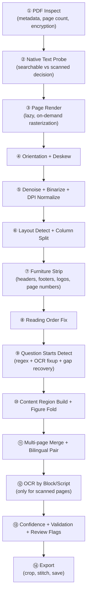

# Qpic

FastAPI app that accepts a PDF, detects MCQ question regions using a smart
3-tier pipeline (text → OCR → AI fallback), crops/stitches each question
(including cross-page questions), and returns a ZIP of images. It ships with a
polished single-page web UI (Adobe Acrobat-style, with light/dark/system
themes) and can run either in the browser or as a native desktop app.

**Highlights**

- **Smart detection** — text, OCR and an optional AI vision tier, with manual
  review + hand-fixing before download.
- **Acrobat-style UI** — a clean web front-end served from `static/index.html`;
  a top app bar, tool tabs (Auto Crop / Manual Crop / Rename Batch / Tools) and a review canvas.
- **Two desktop backends** — pywebview (small) or Qt/PySide6 (consistent
  Chromium rendering). See *Desktop app* below.
- **Offline-capable** — bundles Tesseract for OCR; AI is only used when a key is
  configured and Online mode is on.

## Architecture at a glance

Qpic is split into a **Python backend (the engine)** and **two interchangeable
frontends** that talk to it over a local HTTP API. All the heavy lifting — PDF
parsing, detection, **cropping**, OCR, compression — happens in Python. The
frontends are thin clients that upload a PDF, draw the review canvas, and
download the result.

```
                ┌─────────────────────────────────────────────┐
                │  FRONTEND  (choose one)                       │
                │                                               │
                │  • Web UI      → static/  (HTML + vanilla JS) │
                │  • Desktop app → desktop/ (Flutter / Dart)    │
                └───────────────────────┬───────────────────────┘
                                        │  HTTP (JSON + multipart)
                                        │  http://localhost:8000/api/...
                ┌───────────────────────▼───────────────────────┐
                │  BACKEND  "the engine"  (Python / FastAPI)     │
                │                                               │
                │  app/routers/   → HTTP endpoints              │
                │  app/services/  → detection + CROPPING + OCR  │
                │  PyMuPDF · OpenCV · Tesseract · AI vision     │
                └───────────────────────────────────────────────┘
```

Key point on languages: **cropping is done in Python, not Dart.** The Flutter
desktop app never crops anything itself — when you finish the review it sends the
box coordinates to the Python `/api/finalize` endpoint, and `crop_service.py`
re-renders the crisp images from the PDF vector source. Dart only handles the
window, the canvas UI, and HTTP calls.

### Backend — Python (`app/`)

The engine is a **FastAPI** app. Run with `uvicorn app.main:app`.

| Path | Language | What it does |
|---|---|---|
| `app/main.py` | Python | FastAPI entrypoint — wires routers, CORS, logging, background temp-file cleanup. |
| `app/config.py` | Python | Settings (env vars: AI keys, DPI, OCR confidence, cleanup timers). |
| `app/models/schemas.py` | Python | Pydantic request/response models — the API contract. |
| **`app/routers/`** | Python | HTTP layer. `crop.py` (analyze/finalize/crop/snap), `rename.py`, `tools.py` (compress/edit/preflight). |
| **`app/services/crop_service.py`** | Python | **The actual cropping/stitching** — renders question regions (incl. cross-page) into images. |
| `app/services/detector/` | Python | The 3-tier detection pipeline (see below). |
| `app/services/pdf_service.py` | Python | PDF loading / page rendering / previews (PyMuPDF). |
| `app/services/snap_service.py` | Python | "Snap to content" — tightens a drawn box to the text/figure inside. |
| `app/services/review_service.py` | Python | Builds the review notes (cut-off crops, gaps, missing options). |
| `app/services/answer_sheet.py` | Python | Builds `answers.csv` / `answers.json` from a detected answer key. |
| `app/services/rename_service.py` | Python | Bulk image rename logic. |
| `app/services/zip_service.py` | Python | Packs the final images into `Q.zip` / `S.zip` / `QScombined.zip`. |
| `app/services/pdf_tools/` | Python | Standalone tools: `compress_service.py`, `edit_service.py`, `preflight_service.py`. |

**Detection pipeline** (`app/services/detector/`) — the brain that finds where
each question is, before cropping:

| File | Tier | Role |
|---|---|---|
| `pipeline.py` | — | Orchestrates the 3 tiers and decides when to escalate. |
| `text_detector.py` | 1. Text | Reads the PDF's text layer (free, fast, for searchable PDFs). |
| `ocr_detector.py` / `tesseract_locator.py` | 2. OCR | Tesseract OCR for scanned PDFs (deskew + denoise + threshold). |
| `local_ml_detector.py` | 2.5. Local ML | Optional offline detector — detects question/solution **regions** (bounding box coordinates only, does not read document content). |
| `ai_detector.py` / `openrouter_detector.py` | 3. AI | Vision-model fallback for hard layouts (Anthropic or OpenRouter). |
| `answer_key.py` / `ai_answer_key.py` | — | Reads the answer key (text layer, or AI on scans). |
| `figure_detector.py` / `furniture.py` | — | Detects figures and strips page furniture (headers/dividers). |

Core Python libraries: **FastAPI** + **uvicorn** (web), **PyMuPDF** (PDF render),
**OpenCV** + **Pillow** (image ops), **pytesseract** (OCR), **anthropic** /
OpenRouter via **httpx** (AI vision). Full list in `requirements.txt`.

### Frontend — two options

**1. Web UI — `static/` (HTML + vanilla JavaScript)**
Served by the backend at `http://localhost:8000`. The whole single-page app
lives in `static/index.html` (markup + JS), with `static/edit.html` + `edit.js`
for the full-screen editor. No build step, no framework — open the URL and go.

**2. Desktop app — `desktop/` (Flutter / Dart)**
A native macOS/Windows client. It bundles the Python engine as a hidden
**"sidecar"** process — double-click the app and it starts the server for you,
then renders the UI in a native window (no browser, no terminal).

| Path | What it does |
|---|---|
| `desktop/lib/main.dart`, `app.dart` | App entrypoint + root widget. |
| `desktop/lib/core/api_client.dart` | HTTP client (Dio) that calls the Python `/api/...` endpoints. |
| `desktop/lib/core/sidecar_manager.dart`, `sidecar_bootstrap.dart` | Starts/stops the bundled Python engine and waits for it to be ready. |
| `desktop/lib/core/download_service.dart`, `file_picker_service.dart` | Native open/save dialogs and file writes. |
| `desktop/lib/features/auto_crop/` | Auto-crop tab UI + controller. |
| `desktop/lib/features/review/` | The review canvas — draw/move/delete boxes (`review_painter.dart`, `box_logic.dart`, `canvas_geometry.dart`). Sends boxes to the backend; **does not crop locally**. |
| `desktop/lib/features/rename/` | Rename Batch tab. |
| `desktop/lib/features/tools/` | Compress / Edit / Preflight tabs. |
| `desktop/lib/features/shell/` | App shell, tabs, menu bar, theming, startup gate. |
| `desktop/lib/models/` | Dart DTOs mirroring the backend JSON (`analyze.dart`, `crop.dart`, `rename.dart`, `tools.dart`). |

Dart libraries: **dio** (HTTP), **file_selector** + **desktop_drop** (files),
**window_manager** (window lifecycle), **shared_preferences** (settings),
**path** / **path_provider** (paths). Full list in `desktop/pubspec.yaml`.

> There are also two older Python-based desktop wrappers (`desktop.py` /
> `desktop_qt.py`, pywebview + PySide6) that simply embed the **web UI** in a
> native window. The Flutter app in `desktop/` is the primary native client; the
> Qt/pywebview variants are documented under *Desktop app* below.

## Smart mode + manual review

Beyond the one-shot `/crop` flow, the app has a **Smart mode** (on by default in
the UI) that handles *any* PDF layout and lets you fix detection by hand before
downloading:

1. **Analyze** (`POST /api/analyze`) — runs the pipeline in *smart* mode. The
   cheap text/OCR tiers are accepted only when they look confident (good
   density + unbroken numbering); otherwise it escalates to the Claude vision
   tier so odd layouts/numbering still get detected. Returns the detected
   regions, per-page geometry + preview images, and **review notes**, including
   crops that look **cut off / half** (a crop that stops at the page edge, or is
   much shorter than its neighbours and probably lost its options), likely
   duplicates, and numbering gaps.
2. **Review popup** — the UI shows every detected box over the page previews and
   flags anything uncertain. For a cut-off item you hit **Re-select** (or the
   **Fix** button on its note) and drag the *correct full region* on the page —
   the item's box is replaced. You can also **draw** a box for a missed item, or
   delete extra/duplicate ones. **Snap to content** (on by default) auto-tightens
   any box you draw to the actual text/figure inside it, so a rough drag becomes
   a clean, content-hugging crop.

   Several checks make the review smarter:
   - **Gap recovery** — if the detected numbering skips a value (e.g. 19 → 21),
     the pipeline re-reads the lines between the neighbours with OCR
     digit-confusion fixups (`20.` misread as `2O.` / `Z0.`) and re-inserts the
     missed question instead of silently dropping it.
   - **Answer-key cross-check** — if the paper carries an answer key (`1-B 2-A
     3-D …`), it lists every question number, so the tool knows exactly how many
     questions exist. Any number in the key that wasn't detected is reported as a
     high-confidence miss, and the key also drives gap recovery toward numbers a
     sequence alone wouldn't reveal (e.g. a question missing from the end).
   - **Option check** — standard MCQs have options (A)–(D). A crop that captured
     only some of them (e.g. just the left column `(A)/(C)` of a 2-up grid) is
     flagged as *likely missing its right-hand options* so you can re-select it.
3. **Finalize** (`POST /api/finalize`) — combines the kept auto items and your
   corrected/hand-drawn ones into the final ZIP, re-rendered crisp from the PDF
   vector source. No re-upload: the source PDF is cached in the job dir by
   `/analyze`.

### Scan quality + AI escalation

For scanned (image) PDFs the OCR tier now **deskews** a tilted page, denoises
speckle, and uses an adaptive (Otsu) threshold before reading — a small tilt
otherwise smears Tesseract's line grouping and drops question numbers. It also
records a **per-page confidence**; in Smart mode with an `ANTHROPIC_API_KEY`
configured, only the *low-confidence* pages are re-detected by the AI vision tier
and merged back in, so a few blurry pages get repaired without paying to send the
whole document to the model. Tune the cutoff with `OCR_MIN_CONFIDENCE` (default
75).

Stray horizontal dividers (question separators, table borders) drawn as flat
zero-thickness rules are now removed from crops, while fraction bars (`500/3`)
and text underlines are preserved as real content.

### Local ML mode (offline)

Qpic also has an optional **Local ML** tier that runs after text/OCR and before
any online AI call:

```
text layer → Tesseract OCR → Local ML → optional online AI
```

It is fully offline once the model files are bundled. By default it is a no-op
until a local model or adapter is present, so the app keeps the current small
build size. Configure it with:

```env
LOCAL_ML_ENABLED=true
LOCAL_ML_MODEL_PATH=vendor/models/qpic-question-detector/model.onnx
LOCAL_ML_LABELS_PATH=vendor/models/qpic-question-detector/labels.json
```

The practical 800 MB route is a **HiLEx-trained YOLO question-paper detector**
(`Question_Answer_Block`, `Question_Block`, `Description`, etc.) installed as
`model.onnx` and run with `onnxruntime`. PyTorch/Ultralytics are training/export
tools only and should not be bundled into the desktop app. Qpic also supports
local adapter commands; for model stacks that need their own runner, set
`LOCAL_ML_COMMAND`. Qpic passes a JSON input file path and accepts either
`{"questions": [...]}` or `{"boxes": [...]}` JSON back.

Training/export helpers live in `scripts/local_ml/`:

```bash
.venv/bin/pip install -r requirements-local-ml-train.txt
.venv/bin/python scripts/local_ml/prepare_hilex_yolo.py --hilex-dir /path/to/HiLEx --out-dir temp/hilex_yolo
.venv/bin/python scripts/local_ml/train_hilex_yolo.py --data temp/hilex_yolo/data.yaml --epochs 25 --model yolov8s.pt
.venv/bin/python scripts/local_ml/install_yolo_model.py --weights runs/detect/qpic_hilex/weights/best.pt --imgsz 640 --opset 20
```

For future fine-tuning, turn on `LOCAL_ML_COLLECT_TRAINING_DATA=true`. Finalize
will save `source.pdf` plus reviewed crop boxes under `LOCAL_ML_TRAINING_DIR`
without sending anything to the network.

Turn Smart mode off to keep the original "type page ranges → straight to ZIP"
behaviour.

### Bilingual PDF support

Qpic automatically detects **side-by-side bilingual layouts** (e.g. English left, Hindi right — common in competitive exam papers like JEE Main). When detected:

- Duplicate question numbers in the two columns are **merged** into a single item — no more doubled detection counts.
- The **Bilingual Stitcher** in the review sidebar lets you choose:
  - **English Only** — crops only the English (left) column.
  - **Hindi Only** — crops only the Hindi (right) column.
  - **Bilingual Horizontal** — stitches both columns side by side.
  - **Bilingual Vertical** — stitches both columns top-to-bottom.
  - **Standard** — uses the full detected region as-is.
- Math-only solutions (no translation pair) automatically expand to full page width.
- The app auto-enables bilingual mode when a bilingual layout is detected.

### Pipeline Architecture (14 Stages)

The auto-detection engine operates across a structured 14-stage pipeline:



### Bilingual & Hybrid PDF Detection Pipeline (Step-by-Step)

The auto-detection engine operates in a multi-tier pipeline to process bilingual layouts and hybrid scanned/searchable PDFs:

1. **Per-Page Classification**: 
   The pipeline (`_classify_pages`) first checks the native text layer and image objects of every page in the PDF. Each page is categorized as `"text"` (clean, native searchable text), `"ocr"` (image/scan page), or `"text_then_ocr"` (mixed content page).
2. **Page-Level Hybrid Routing**: 
   Instead of choosing a single detector for the entire document, the pipeline routes each page dynamically. It uses fast vector text extraction for `"text"` pages and automatically escalates to image-based OCR detectors (Tesseract or PaddleOCR) for `"ocr"` and `"text_then_ocr"` pages.
3. **Scan Pre-processing (Rotation & Thresholding Fallbacks)**:
   When running OCR on a scanned page:
   - **Tesseract OSD**: Orientation and Script Detection (`--psm 0`) determines if the page is rotated (90°, 180°, or 270°) and rotates it back upright.
   - **Deskew & Median Blur**: Corrects slight paper tilts and removes scanner speckles.
   - **Otsu Binarization**: Automatically calculates local thresholds to isolate text glyphs.
   - **Adaptive Gaussian Fallback**: If Otsu results in a mostly blank white or black image (low contrast), it falls back to `cv2.adaptiveThreshold` to retrieve clean character edges.
4. **Bilingual Column-Wise Starts Grouping**:
   If a bilingual layout is present, sequential grouping across columns can cause bottom-of-page crossover. The pipeline splits the question starts, content lines, and figures independently by column index (`Column 0` vs `Column 1`), groups them recursively using a recursion-safe parameter (`_disable_bilingual=True`), and then merges the column pairs together.
5. **Script-Aware Column Mapping**:
   The engine analyzes the character scripts (checking Devanagari code range `\u0900-\u097F` vs Latin characters) and option label styles (Latin MCQ option labels) to determine which column is the primary (English) language and which is the translation (Hindi). This ensures correct left/right assignment even when Hindi appears on the left.
6. **Reference-Based Deduplication**:
   For questions spanning page boundaries, the hybrid loop might yield duplicate object references. The engine deduplicates the questions by Python object ID (`id(q)`). This avoids duplicate crop rendering and prevents `resolve_vertical_overlaps` from comparing a question to itself and incorrectly shrinking its height to zero.
7. **Numerical Confidence Scoring**:
   A numerical confidence score (`0.0` to `1.0`) is calculated for each question segment using multiple indicators:
   - Crop height compared to neighboring crops (flagging abnormally short or tall crops)
   - Overlap with other crops on the page
   - Completeness of MCQ option labels (checking if options A-D are present)
   - Boundary checks (continuation onto the next page)
   - Uncovered body text left above or below the crop

## Tech stack summary

| Layer | Tech / Language | Lives in |
|---|---|---|
| Backend / engine | **Python** — FastAPI, uvicorn | `app/` |
| PDF rendering | **Python** — PyMuPDF | `app/services/pdf_service.py` |
| **Cropping / stitching** | **Python** — PyMuPDF + Pillow | `app/services/crop_service.py` |
| Detection (text/OCR/Local ML/AI) | **Python** — OpenCV, pytesseract, optional ONNX/local model, anthropic/httpx | `app/services/detector/` |
| PDF tools (compress/edit/preflight) | **Python** — PyMuPDF | `app/services/pdf_tools/` |
| API contract | **Python** — Pydantic | `app/models/schemas.py`, `app/routers/` |
| Web frontend | **HTML + vanilla JavaScript** | `static/` |
| Desktop frontend | **Dart / Flutter** | `desktop/` |
| Desktop ↔ engine | HTTP (Dio in Dart → FastAPI) | `desktop/lib/core/api_client.dart` |
| Legacy desktop wrappers | **Python** — pywebview / PySide6 (embed the web UI) | `desktop.py`, `desktop_qt.py` |

**Short answer to "is cropping Dart or Python?"** → **Python.** The Flutter
desktop app only collects the box coordinates and calls the Python engine, which
does the actual crop.

### Answer sheet (auto-generated)

When a paper carries an **answer key** (`1-B 2-A 3-D …`), every download also
includes an **answer sheet** that pairs each cropped question image with its
correct option:

- `answers.csv` — opens straight into Excel/Sheets (`file, question, answer`),
  e.g. `Q001.png, 1, B`.
- `answers.json` — the machine-readable form for importing into a quiz/Anki
  pipeline.

The sheet rides along in the **questions** and **combined** ZIPs (not the
solutions-only one, since it's keyed to the question images). The key is read
**for free** from a searchable PDF's text layer; on a **scanned** paper whose
text layer is empty, the AI vision tier (Opus) reads the key from the page
images instead — but only when **Online mode** is on and an AI key is
configured. A paper without any answer key simply ships no sheet.

Toggle it per run with the **Answer sheet** switch in the **Output options**
panel (on by default). To turn it off globally, set
`ANSWER_SHEET_ENABLED=false`.

### Online / Offline mode (AI vision)

The UI has an **Online mode (AI)** toggle (top of the "What to crop" panel):

- **On** — the AI vision tier is allowed. The cheap text/OCR tiers still run
  first; AI is only used as a fallback for hard layouts and for repairing
  low-confidence scanned pages.
- **Off** — a fully **offline** run. Only the text and OCR tiers are used, so no
  network calls are made. Use this when you have no key, no internet, or want
  guaranteed-local processing.

The toggle auto-disables itself when the server reports no AI key is configured.

**Configuring the AI key.** Two providers are supported (set in `.env`):

```bash
# OpenRouter (OpenAI-compatible — Gemini / Qwen / Llama / free models)
AI_PROVIDER=openrouter
OPENROUTER_API_KEY=sk-or-...
OPENROUTER_MODEL=nvidia/nemotron-nano-12b-v2-vl:free   # a free model, or a paid one for accuracy

# …or Anthropic
AI_PROVIDER=anthropic
ANTHROPIC_API_KEY=sk-ant-...
CLAUDE_MODEL=claude-opus-4-8
```

`AI_PROVIDER=auto` (default) prefers OpenRouter when its key is set, else
Anthropic. With no key configured, the app runs offline-only regardless of the
toggle.

### Question numbering style

Both `/crop` and `/analyze` accept `marker_style` to control which numbering is
treated as a real question, so sub-statements, option labels and equation
numbers in the body aren't mistaken for questions:

- `auto` (default) — prefer explicit `Q` markers; fall back to bare numbers.
- `q` — only `Q1` / `Q.1` / `Question 1` style markers count.
- `numbered` — only bare leading numbers (`1.`, `2)`) count.

The UI exposes this as a **Question numbering** dropdown. The chosen style is
honoured by every detection tier (text, OCR and the AI vision prompt).

## How to use the app

Once the server is running (see *How to run* below), open **http://localhost:8000** in your browser. Here's the typical workflow:

### 1. Upload a PDF
- Click **"Choose PDF"** (or drag-and-drop a file onto the upload area).
- Select your MCQ question paper PDF.

### 2. Configure detection options
| Option | What it does |
|---|---|
| **Question numbering** | `auto` works for most papers. Switch to `q` if questions are labelled `Q1/Q2…`, or `numbered` for bare `1. 2. 3.` style. |
| **Online mode (AI)** | Toggle ON to allow the AI vision fallback for tricky layouts. Requires an API key in `.env`. Toggle OFF for a fully offline run. |
| **Smart mode** | ON (default) — runs the full pipeline and opens the review canvas. OFF — skips review and goes straight to ZIP. |
| **Answer sheet** | ON (default) — bundles `answers.csv` + `answers.json` (each question image → correct option) when the PDF has an answer key. OFF — skips it. Lives in the **Output options** panel. |

### 3. Analyze
- Click **Analyze**. The app runs text → OCR → AI detection and shows a **review canvas** with every detected question box overlaid on the page previews.

### 4. Review & fix detections
- **Green boxes** = detected questions. Hover to see the question number.
- **Review notes** on the right flag anything suspicious (cut-off crops, numbering gaps, missing options).
- To fix a bad box: click its **Fix / Re-select** button, then drag the correct region on the page image.
- To add a missed question: click **Draw**, drag a box around it.
- To remove a duplicate: click the box → **Delete**.
- **Snap to content** (on by default) auto-tightens any box you draw to the actual text/figure inside it.

### 5. Download
- Once happy with the review, click **Finalize & Download**.
- Choose the download type:
  - **Combined** — questions + solutions in one ZIP (`QScombined.zip`)
  - **Questions only** — `Q.zip`
  - **Solutions only** — `S.zip`

### Rename Batch tab
Switch to the **Rename Batch** tab to bulk-rename a folder of already-cropped images using a custom prefix and numbering scheme.

### Tools tab (Compress / Edit / Preflight)

The **Tools** tab bundles three standalone PDF utilities, all powered by PyMuPDF
on the backend (no extra binaries beyond the optional Tesseract for OCR):

- **Compress PDF** — shrink a PDF by recompressing its images, subsetting fonts
  and cleaning the object streams. Pick a **level** (`light` / `balanced` /
  `strong` / `extreme`) or set a **target size in MB** and the tool pushes
  quality down until the file fits (best-effort, never below readable quality).
  The result reports the before/after size and the percentage saved.
- **Edit PDF** — edit text **in place**. Each text run is shown as a clickable
  box over a page preview; changes are re-inserted using the document's **own
  embedded font**, at the same size and colour, fitted to the original box (a
  Base-14 / closest-match fallback is used when the original font can't be
  reused). A **Run OCR** button turns a scanned/image PDF into a searchable one
  (invisible Tesseract text layer) so its text becomes editable too.
- **Preflight PDF** — a read-only prepress check: page count/sizes, embedded vs.
  non-embedded fonts, image resolution (low-DPI = blurry in print), RGB vs CMYK
  colour, encryption and a searchable-text check, rolled up into a single
  PASS / WARN / FAIL verdict with actionable messages.

---

## How to run

```bash
# 1. Install Tesseract (for OCR tier)
# Mac:   brew install tesseract
# Linux: sudo apt install tesseract-ocr
# Win:   https://github.com/UB-Mannheim/tesseract/wiki

# 2. Install dependencies
pip install -r requirements.txt

# 3. Set up environment (AI key optional)
cp .env.example .env
# Edit .env and optionally add ANTHROPIC_API_KEY

# 4. Start server
uvicorn app.main:app --reload --port 8000

# 5. Open browser
# http://localhost:8000

# 6. API docs
# http://localhost:8000/docs

# 7. Run tests
pytest tests/ -v

# 8. Docker (includes Tesseract automatically)
docker build -t qpic .
docker run -p 8000:8000 --env-file .env qpic
```

## Endpoints

- `POST /api/crop` — upload PDF (`multipart/form-data` field `file`) with optional query params `dpi`, `padding` and `marker_style`
- `POST /api/analyze` — smart-detect and return regions + page previews + review notes (no ZIP yet)
- `GET /api/analyze/{job_id}/page/{n}` — page-preview PNG for the manual-crop canvas
- `POST /api/snap` — tighten a roughly drawn box to the content inside it
- `POST /api/finalize` — JSON body of reviewed items (auto + manual) → builds the ZIPs
- `GET /api/crop/download/{job_id}` — download a ZIP. Optional `kind` query param: `combined` (default, questions + solutions → `QScombined.zip`), `questions` (questions only → `Q.zip`), or `solutions` (solutions only → `S.zip`). `question_prefix` / `solution_prefix` set the download filename.
- `GET /api/health` — health check

### Tools endpoints

- `POST /api/tools/compress` — `multipart/form-data` field `file`, plus `level` (`light`/`balanced`/`strong`/`extreme`) **or** `target_mb`. Returns sizes + `download_url`.
- `GET /api/tools/compress/download/{job_id}` — download the compressed PDF.
- `POST /api/tools/preflight` — field `file`; returns the full preflight report (verdict, checks, fonts, images, metadata).
- `POST /api/tools/edit/open` — field `file`; stages the PDF and returns editable text spans (with geometry/font/size/colour) + page previews.
- `POST /api/tools/edit/apply` — JSON `{job_id, edits:[{page, bbox, new_text, font?, size?, color?}]}`; applies font-matched replacements. Returns `download_url`.
- `POST /api/tools/edit/ocr` — field `file`, optional `languages` (e.g. `eng+hin`) and `dpi`; adds an invisible OCR text layer and makes the result the new editable source.
- `GET /api/tools/edit/download/{job_id}` — download the edited (or OCR'd) PDF.

## Desktop app (no terminal, no server to start manually)

The desktop client is a **native Flutter app** (`desktop/`, macOS + Windows). It
bundles the Python engine as a hidden **sidecar** process — double-click the app
and it launches the server for you, health-checks it, and renders the UI in a
native window (no browser, no terminal). All processing still happens in the
unchanged Python engine; the Flutter app only owns the window, the canvas, and
the HTTP calls.

### Build the installers

Two build drivers wrap the whole pipeline (install sidecar deps → vendor
Tesseract → build the PyInstaller sidecar → `flutter build` → embed the sidecar →
package the per-OS installer → optionally sign/notarize):

```bash
# macOS  → dist/Qpic.dmg
./build_desktop_flutter.sh

# Windows (PowerShell)  → MSIX or NSIS installer under dist/
./build_desktop_flutter.ps1
```

Each driver runs the same steps:

1. `pip install -r requirements.txt -r requirements-desktop.txt` — sidecar deps.
2. `python scripts/vendor_tesseract.py --langs eng,hin,osd` — vendor Tesseract.
3. `pyinstaller packaging/sidecar.spec --noconfirm` — build the headless sidecar (onedir).
4. `flutter build macos` / `flutter build windows` — build the native app.
5. Embed the sidecar into the Flutter bundle and package the installer — `.dmg`
   on macOS (via `packaging/macos/`), MSIX or NSIS on Windows (via
   `packaging/windows/`).
6. Sign/notarize when the cert env vars are present (`MAC_CERT_IDENTITY` /
   `AC_NOTARY_PROFILE` on macOS, `WIN_CERT_PATH` / `WIN_CERT_PASSWORD` on
   Windows); the build is **unsigned** when they're absent.

Notes:
- You can only build the macOS installer on a Mac and the Windows installer on
  Windows; one machine can't build the other's. To build **both** without two
  machines, use the GitHub Actions workflow (see *CI builds* below).
- An **unsigned** build shows an "unidentified developer" warning on first launch
  on macOS — right-click the app → **Open** to allow it.
- **OCR works offline out of the box.** The build vendors a self-contained
  Tesseract (binary + libraries + `eng`/`hin`/`osd` language data) into the app
  via `scripts/vendor_tesseract.py`, so scanned PDFs are handled with no
  separate Tesseract install on the user's machine. By default the bundled
  language data is pulled from the high-accuracy `tessdata_best` (LSTM) models
  rather than the smaller models a system Tesseract usually ships — a few MB
  larger per language but noticeably better on math / mixed-script exam scans.
  (Pass `--no-prefer-best` to `vendor_tesseract.py` to use the build host's
  local copy instead.) At runtime the app finds Tesseract in this order:
  `TESSERACT_CMD` env var → the copy bundled inside the app → a standard system
  install → whatever is on `PATH`. The AI fallback still needs internet + an
  API key.
- Cropped images/zips are written to a per-user folder
  (`~/Library/Application Support/Qpic` on macOS, `%LOCALAPPDATA%\Qpic` on
  Windows).

### Run from source (development)

For day-to-day development you don't need to build the PyInstaller bundle. Run
the Flutter app straight from `desktop/` and it auto-starts the sidecar from
source:

```bash
# one-time: install the sidecar's Python deps
pip install -r requirements.txt -r requirements-desktop.txt

# run the native app (it starts the sidecar for you)
cd desktop
flutter run -d macos      # or: flutter run -d windows
```

When no packaged sidecar binary is present, `desktop/lib/core/paths.dart` falls
back to launching the engine via **`python -m packaging.sidecar`** using the
project's Python, so engine changes are picked up without a rebuild. You can also
run that headless sidecar on its own for debugging:

```bash
QPIC_PORT=8000 QPIC_TEMP_DIR=/tmp/qpic python -m packaging.sidecar
```

### Retiring the legacy desktop shells (`desktop.py` / `desktop_qt.py`)

The repo still contains the older Python desktop wrappers `desktop.py`
(pywebview) and `desktop_qt.py` (PySide6/Qt), which embed the **web UI** in a
native window. The Flutter app in `desktop/` supersedes both — it reproduces
their entire role (window shell, server bootstrap, native Save-As bridge, Help
menus, zoom shortcuts) in `SidecarManager` + `packaging/sidecar.py`.

**Recommendation: retire `desktop.py` and `desktop_qt.py` once the Flutter build
is validated on both macOS and Windows — but not before.** Reasoning:

- They are **not** part of the engine, so removing them changes nothing about the
  API or processing.
- Keeping them during the transition is useful as a behavior-parity reference
  (especially the review canvas and Save-As streaming) and as a fallback if a
  Flutter platform issue blocks a release.
- Once CI produces Flutter installers for both OSes and the canvas parity
  checklist passes, delete `desktop.py`, `desktop_qt.py`, `desktop.spec`,
  `desktop_qt.spec`, `build_desktop.sh`, `build_desktop.bat`,
  `build_desktop_qt.sh`, and the pywebview/PySide6 entries in
  `requirements-desktop-qt.txt`, trimming `requirements-desktop.txt` to the
  sidecar's needs.

Until then they remain in-tree and functional; the engine keeps serving
`static/`, so the legacy shells work as a fallback during the transition.


## CI builds (both macOS + Windows, no second machine)

`.github/workflows/build-desktop.yml` builds the desktop app on **both**
`macos-latest` and `windows-latest` runners. Each runner installs Tesseract,
vendors it into the bundle, runs PyInstaller, and uploads an installer-ready
archive (`Qpic-macOS.zip` / `Qpic-Windows.zip`).

- **Run it on demand:** Actions tab → *Build desktop apps* → *Run workflow*.
  Download the results from the run's *Artifacts*.
- **Cut a release:** push a tag like `v1.0.0` and the workflow attaches both
  archives to a GitHub Release automatically.

## License

Released under the [MIT License](LICENSE) — © 2026 Aniket Mishra.


